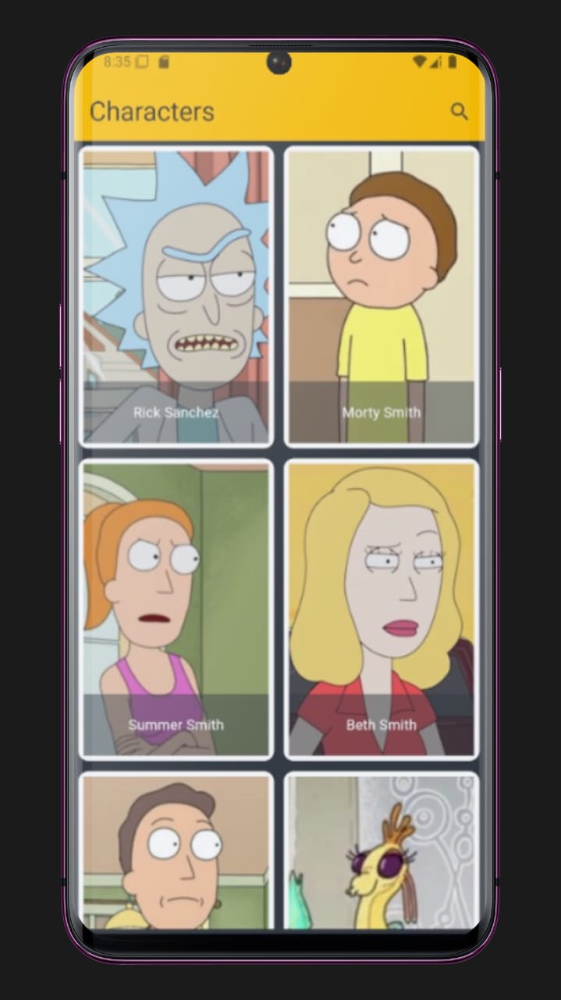
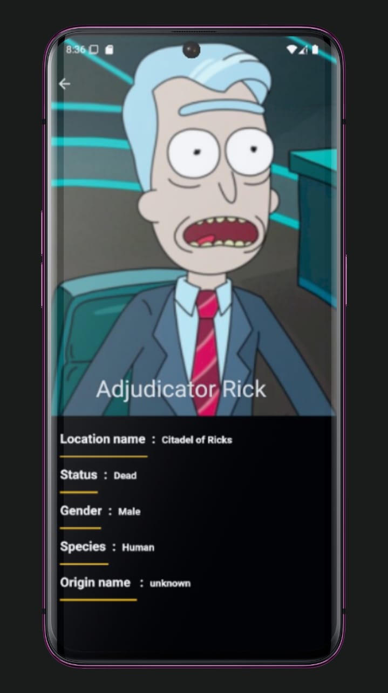
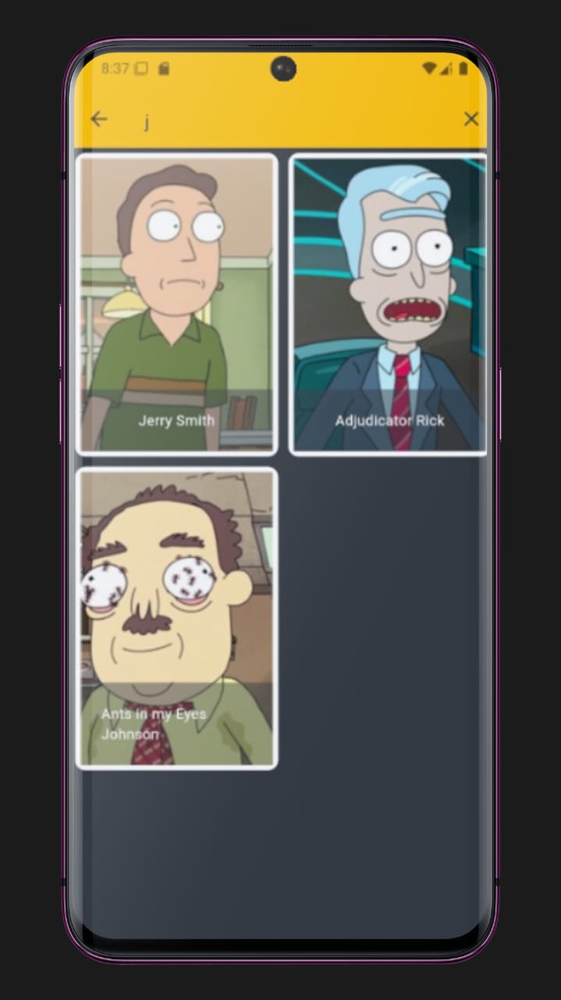
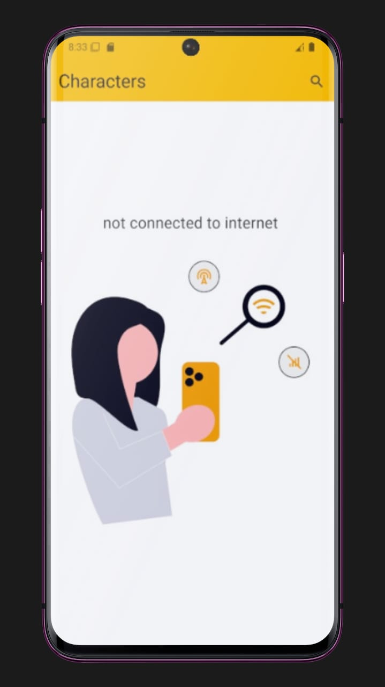

# flutter_breaking

Cross-platform Flutter app

Description

Cross-platform Flutter application that fetches and displays character data with a searchable list and a detailed character view. The project follows a layered architecture to separate responsibilities: WebServices → Repository → Cubit (Bloc) → UI. It also supports an Offline Mode that detects when there is no internet connection and displays a dedicated “No Internet” screen.

## Technologies

- Dart
- Flutter
- Dio (HTTP client)
- Bloc / Cubit (state management)
- get_it (dependency injection)
- Flutter offline package  

## Architecture 

Layered architecture used in this project:

- WebServices: responsible for HTTP requests and raw responses.
- Repository: transforms raw responses into model objects and handles data logic.
- Cubit (Bloc): manages UI state, reacts to user interactions and repository results.
- UI: presentation layer (screens & widgets) which subscribes to Cubit state.

This separation allows easier testing and clearer responsibilities.

## Screenshots 

Home :

Detail :

search feature : 

 offline mode : 

